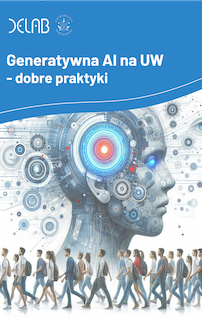

    

<h1 style="margin-top: 50px; color: #3485C8"> <b>Generatywna AI na UW - dobre praktyki </b></h1>

    <!-- Sekcja autorów -->
    

        Autorzy: 
        Renata Włoch  
        Katarzyna Śledziewska 
        Satia Rożynek 
        Michał Paliński 
        Joanna Mazur 
        Weronika Łebkowska 
        
        <!-- Cytowanie raportu -->
  

    <b style="font-weight: bold; color: #3485C8;">Cytowanie raportu:</b> 
    Śledziewska, K., Włoch, R., Rożynek, S., Paliński, M., Mazur, J., Łebkowska, W. (2024). <i>Generatywna AI na UW - dobre praktyki</i>. Uniwersytet Warszawski. DOI: <a href="https://zenodo.org/records/13938497" target="_blank">10.5281/zenodo.13938497</a>

    

    
    <!-- Sekcja raportu z przyciskiem do PDF -->

        
            Raport jest dostępny także w formie PDF
        
         
        
            (kliknij, aby pobrać raport)
        
         
        
    

 
<b>W DELab UW transformacją cyfrową zajmujemy się na co dzień. </b>Jednym z jej najnowszych przejawów jest generatywna sztuczna inteligencja (generative AI, genAI) - technologia, której przyglądamy się z różnych perspektyw. Za nami pierwsze raporty dotyczące generatywnej AI i edukacji, a także dogłębna analiza kompetencji potrzebnych w dobie AI w małych i średnich przedsiębiorstwach. Badamy, jak pracownicy postrzegają zmiany technologiczne, oraz poszukujemy kreatywnych zastosowań generatywnej AI w procesach. Przeprowadziliśmy również kursy z zakresu generatywnej AI dla naukowców  oraz administracji Uniwersytetu Warszawskiego. Na seminariach DELabu chętnie dzielimy się pomysłami na nowe zastosowania modeli AI w naszej pracy.

 
W tym raporcie prezentujemy zbiór <b> dobrych praktyk </b> opracowanych na podstawie przeglądu literatury, wytycznych UW oraz innych uniwersytetów, badania opinii społeczności UW, a także naszego zespołowego doświadczenia w korzystaniu z generatywnej AI. Omawiamy między innymi sposoby wykorzystania i cytowania generatywnej AI, wyzwania etyczne oraz te związane z prywatnością, a także podpowiadamy, skąd czerpać wiedzę o generatywnej AI i gdzie szukać wzorów promptów. Liczymy, że nasze rekomendacje, wraz z ich uzasadnieniem i praktycznymi wskazówkami, będą przydatne zarówno w pracy badawczej i dydaktycznej, jak i w procesie studiowania.

 
W raporcie publikujemy pierwsze wyniki badania przeprowadzonego przez DELab UW wśród społeczności akademickiej UW, w którym pytaliśmy <b>o opinie, sposoby wykorzystywania, obawy oraz oczekiwania wobec generatywnej AI</b>. Wyniki te są powiązane z konkretnymi dobrymi praktykami, abyście mogli zobaczyć, jak Wasze koleżanki, koledzy, studenci i wykładowcy postrzegają i wykorzystują generatywną AI. Raport ma formę interaktywnej strony internetowej, którą planujemy regularnie aktualizować w miarę rozwoju narzędzi generatywnej AI i zmieniających się regulacji.

 
W raporcie stosujemy następujące oznaczenia dla poszczególnych grup społeczności akademickiej UW:

 Badacze i badaczki

 Dydaktycy i dydaktyczki

 Studenci i studentki

<h2 style="color:#3485C8"><b> Opracowanie raportu</b> </h2>

 
Raport został przygotowany przez zespół DELab UW. Tekst raportu został napisany przez Satię Rożynek, Michała Palińskiego, dr Joannę Mazur i Weronikę Łebkowską. Dr hab. Katarzyna Śledziewska, prof.ucz., oraz dr hab. Renata Włoch, prof.ucz., były odpowiedzialne za konceptualizację badania oraz zapewniły nadzór merytoryczny. 

 
Serdeczne podziękowania za współpracę i cenne uwagi dotyczące badania kierujemy do wszystkich członków zespołu, a w szczególności dr Wojciecha Hardego, dr Marty Kołodziejskiej, dr Agaty Komendant-Brodowskiej, Moniki Kot, dr Weroniki Przecherskiej, dr Agnieszki Pugacewicz oraz dr hab. Magdaleny Słok-Wódkowskiej, prof.ucz. Dziękujemy również osobom, które poświęciły swój czas na udzielenie informacji zwrotnej  podczas pilotażu badania – Wasz wkład w rozwój kwestionariusza był nieoceniony.

 
Szczególne podziękowania kierujemy do zespołu rektorskiego, na czele z Jego Magnificencją Rektorem Alojzym Nowakiem, za wsparcie podczas procesu badawczego, w którym uczestniczyła cała społeczność akademicka UW. Dziękujemy również Dziekanom jednostek za pomoc w rozpowszechnianiu ankiety wśród pracowników i studentów.

 
I przede wszystkim ogromne podziękowania dla Was – naszych kolegów i koleżanek z UW oraz studentów i studentek, którzy poświęciliście swój czas, by odpowiedzieć na nasze pytania. To z myślą o Was zaczęliśmy dzielić się naszą wiedzą na temat zastosowań genAI, nagrywając nasze rozmowy (<a href="https://www.youtube.com/playlist?list=PLwDFdcFcnJLGERgIjGNF-V1IAPCApNJnl" target="_blank">link</a>). Wierzymy, że odpowiednie wykorzystanie genAI w naszej społeczności otworzy przed nami nowe możliwości, zarówno w pracy naukowej, jak i dydaktycznej.

← [wróć do dobrych praktyk](cel.md)
